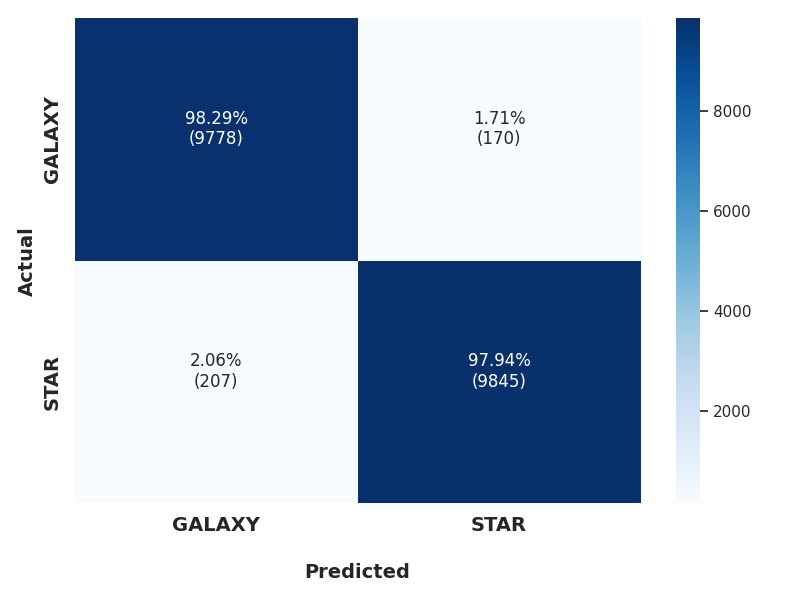
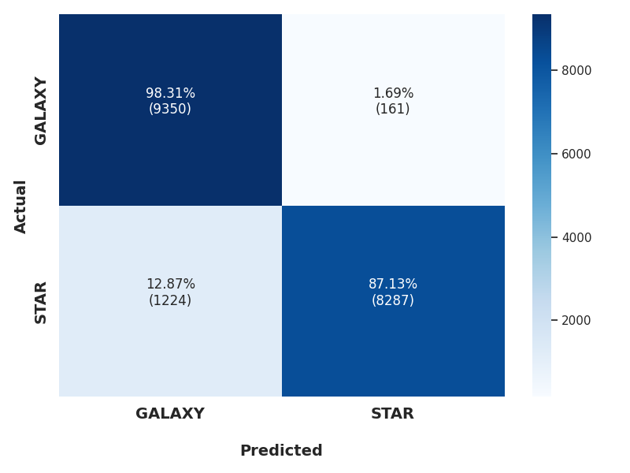
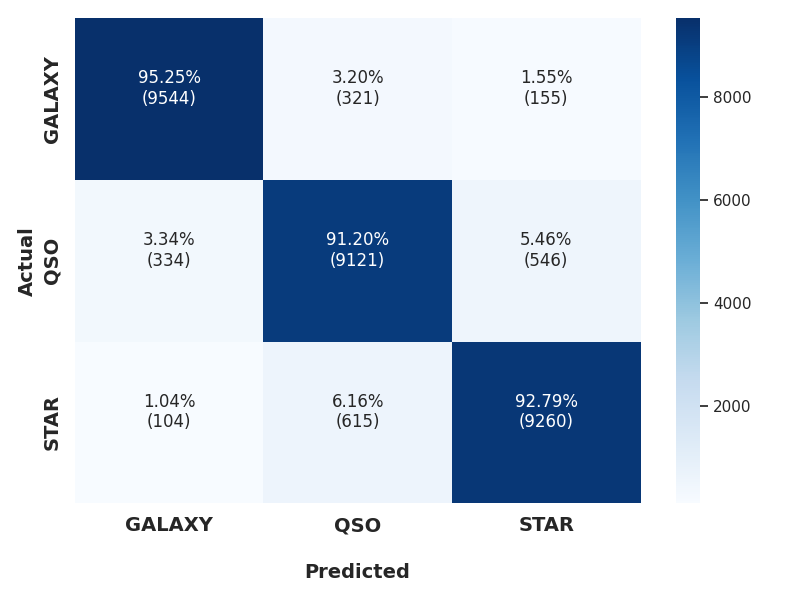
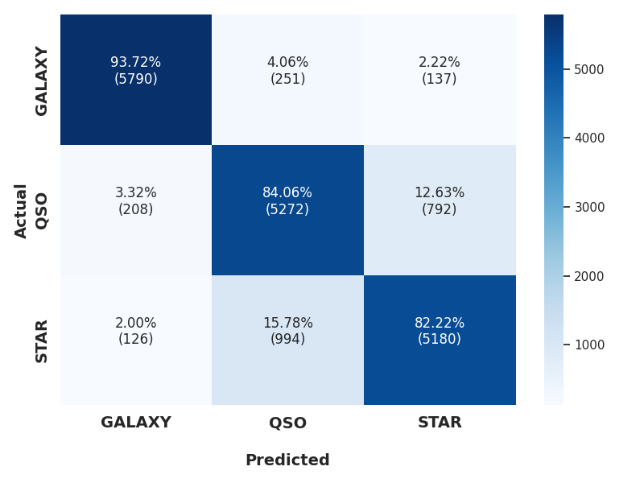
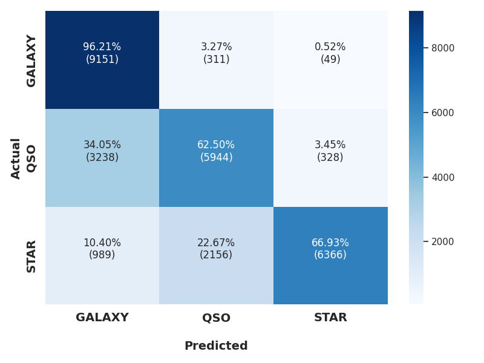
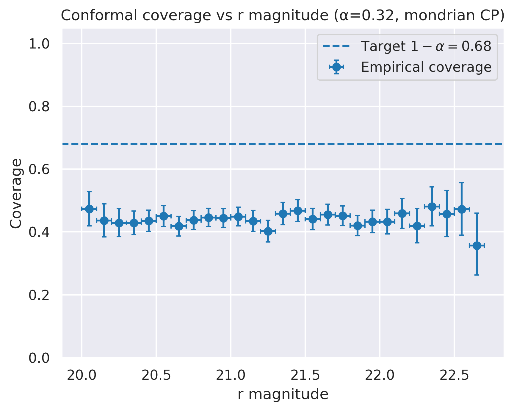

# AstroFormer

**A Unified Framework for Integrating Photometry and Imaging in Astronomy using Cross-Attention Transformers**

AstroFormer explores modern deep learning architectures, specifically Cross-Attention Vision Transformers, to synergistically integrate heterogeneous astronomical data types: photometric parameters and multi-band imaging data. AstroFormer aims to enhance the performance, efficiency, and generalization capabilities of models applied to fundamental astronomical tasks by processing these modalities within a unified framework, moving beyond traditional methods that often process data streams separately before late-stage fusion. The core idea is to leverage photometric information (like brightness, colours, and concentration indices) to *guide* the feature extraction process from imaging data. This is achieved by employing a cross-attention mechanism where photometric features act as *queries*, probing the *keys* and *values* derived from image patches. This allows the model to learn intricate cross-modal correlations and focus on visual details most relevant given the photometric context of the source.

## Applications

AstroFormer provides a flexible framework adaptable to astronomical problems requiring the fusion of tabular (photometric) and visual (imaging) data. Key applications currently explored or planned include:

### 1. Astronomical Source Classification (Star-Galaxy-Quasar Separation)

*   **Goal:** Accurately distinguish between stars, galaxies, and quasars, a fundamental step in catalog generation and numerous downstream scientific analyses (e.g., cosmology, galaxy evolution studies, Galactic structure mapping).
*   **Challenge:** Classification becomes particularly difficult for faint and compact objects where traditional morphological or color-based methods often struggle. Point-like quasars can be mistaken for stars, and compact galaxies resemble point sources at large distances or faint magnitudes.
*   **AstroFormer Approach (`MargFormer`):** By using photometry to query image features, the model can better disentangle subtle morphological differences or color-space overlaps that might confuse models relying solely on one data type or simple fusion. This is expected to improve accuracy and robustness, especially for the challenging faint/compact regimes critical for upcoming deep surveys like LSST and Euclid.

### 2. Photometric Redshift Estimation

*   **Goal:** Estimate the redshift (a proxy for distance) of celestial objects using only photometric data and associated images, bypassing the need for time-consuming spectroscopic observations. Accurate photo-z's are crucial for large-scale structure mapping, cosmological parameter estimation (e.g., Dark Energy equation of state), and galaxy evolution studies over cosmic time.
*   **Challenge:** Achieving high precision (low scatter) and accuracy (low bias), and minimizing the rate of catastrophic outliers across a wide range of redshifts and object types, remains a significant challenge.
*   **AstroFormer Approach:** Integrating morphological information from images (e.g., galaxy type, size, profile) directly with photometric colors and magnitudes through cross-attention could provide complementary information to break degeneracies inherent in photometry-only methods, potentially leading to more accurate and robust redshift predictions. The model can learn how specific morphologies correlate with photometric properties at different redshifts.

## Implemented Models & Datasets

### 1. `MargFormer`: Classification Model

*   **Task:** Star-Galaxy-Quasar classification.
*   **Description:** `MargFormer` is the specific implementation of the AstroFormer concept tailored for the SG/SGQ classification tasks. It utilizes a cross-attention mechanism where photometric features (queries) probe image patch embeddings (keys/values), allowing for unified processing of both data types.
*   **Dataset:** The model is developed and evaluated using data products from the **Sloan Digital Sky Survey (SDSS) Data Release 16 (DR16)** [1]. This includes:
    *   Derived photometric features (magnitudes, colors, etc.).
    *   Corresponding FITS images in u, g, r, i, z filters.
    *   Ground-truth spectroscopic classifications from the official SDSS pipeline.
    *   Two specific datasets are generated based on the methodology in [2]:
        *   **Compact source dataset:** Contains relatively brighter sources identified as compact based on criteria described in [2].
        *   **Faint and Compact source dataset:** Contains sources that are both faint (average magnitude > 20) and compact.
*   **Focus:** The evaluation specifically targets challenging populations of faint and compact objects.
*   **Experimental Setup:** To rigorously evaluate performance and generalization, we replicate the three experimental scenarios defined in [2]:
    *   **Experiment 1:**
        *   **Training & Validation:** Compact source dataset.
        *   **Testing:** Compact source dataset.
        
    *   **Experiment 2:**
        *   **Training & Validation:** Faint and Compact source dataset.
        *   **Testing:** Faint and Compact source dataset.
        
    *   **Experiment 3:**
        *   **Training & Validation:** Compact source dataset.
        *   **Testing:** Faint and Compact source dataset.
        *   Critically assess the model's ability to generalize from the brighter compact training regime to the more challenging faint and compact testing regime, simulating real-world application scenarios.
*   **Comparability:** Using identical datasets, selection criteria, and experimental setups as [2] ensures direct comparability of `MargFormer`'s performance against the baseline results established in that work (e.g., the MargNet model).
*   **References:**
    *   [1] Ahumada, R., et al. (2020). *The 16th Data Release of the Sloan Digital Sky Surveys: First Release from the APOGEE-2 Southern Survey and Full Release of eBOSS Spectra*. ApJS, 249(1), 3. ([DOI: 10.3847/1538-4365/ab929e](https://doi.org/10.3847/1538-4365/ab929e))
    *   [2] Chaini, P., et al. (2023). *MargNet: A Machine Learning Framework for Photometric Classification of Faint Compact Sources in SDSS DR16*. MNRAS, 521(3), 3788–3799. ([DOI: 10.1093/mnras/stad719](https://doi.org/10.1093/mnras/stad719))

## Results

The performance of the MargFormer model, utilizing photometric features as queries within its cross-attention mechanism, was rigorously evaluated on both Star-Galaxy (SG) and Star-Galaxy-Quasar (SGQ) classification tasks. We followed the three experimental setups defined in Section 2 [2] to assess performance under different data conditions and test generalization capabilities.

### Performance Metrics

Table 1 summarizes the key classification metrics: Accuracy, Precision, and Recall, averaged over 3 independent runs to estimate uncertainty.

**Table 1: MargFormer Classification Performance Metrics**

| Experiment | Classification Task | Accuracy (%) | Precision (%) | Recall (%) |
|---|---|---|---|---|
| **Experiment 1** | Star-Galaxy | 98.1 ± 0.1 | 98.1 ± 0.1 | 98.1 ± 0.1 |
| Compact Train/Test | Star-Galaxy-Quasar | 93.2 ± 0.1 | 93.3 ± 0.1 | 93.2 ± 0.1 |
| **Experiment 2** | Star-Galaxy | 97.1 ± 0.1 | 97.1 ± 0.1 | 97.1 ± 0.1 |
| Faint+Compact Train/Test | Star-Galaxy-Quasar | 86.7 ± 0.1 | 86.8 ± 0.1 | 86.7 ± 0.1 |
| **Experiment 3** | Star-Galaxy | 92.7 ± 0.1 | 93.2 ± 0.1 | 92.7 ± 0.1 |
| Compact Train, Faint+Compact Test | Star-Galaxy-Quasar | 75.2 ± 0.1 | 77.9 ± 0.1 | 75.3 ± 0.1 |

### Confusion Matrices

To gain deeper insights into the specific classification performance for each class and identify common misclassification patterns, we present the confusion matrices for both the SG and SGQ tasks across the three experiments. The values shown are typically normalized by the true class count (recall) or represent raw counts.

**Figure 1: Confusion Matrices for Star-Galaxy (SG) Classification**

| Experiment 1 (Compact Train/Test) | Experiment 2 (Faint+Compact Train/Test) | Experiment 3 (Generalization Test) |
|---|---|---|
|  |  |  |

Confusion matrices for the binary Star-Galaxy classification task in Experiment 1 (left), Experiment 2 (center), and Experiment 3 (right). High diagonal values indicate correct classifications. Off-diagonal elements show misclassifications between stars and galaxies.

**Figure 2: Confusion Matrices for Star-Galaxy-Quasar (SGQ) Classification**

| Experiment 1 (Compact Train/Test) | Experiment 2 (Faint+Compact Train/Test) | Experiment 3 (Generalization Test) |
|---|---|---|
|  |  |  |

Confusion matrices for the three-class Star-Galaxy-Quasar classification task in Experiment 1 (left), Experiment 2 (center), and Experiment 3 (right). Observe the distribution of classifications across true and predicted classes, particularly the confusion between stars and quasars, and potentially compact galaxies.

### Conformal Predictions

To understand the model in detail, we present the conformal predictions using Mondrian Conformal Prediction (MCP) for both the SG and SGQ tasks across the three experiments. 

**Figure 1: MCP for Star-Galaxy (SG) Classification with Margformer on Experiemnt3**

| Coverage | ROC | Coverage vs r-magnitude |
|---|---|---|
|  |  |  |

Confusion matrices for the binary Star-Galaxy classification task in Experiment 1 (left), Experiment 2 (center), and Experiment 3 (right). High diagonal values indicate correct classifications. Off-diagonal elements show misclassifications between stars and galaxies.

**Figure 2: Confusion Matrices for Star-Galaxy-Quasar (SGQ) Classification**

| Experiment 1 (Compact Train/Test) | Experiment 2 (Faint+Compact Train/Test) | Experiment 3 (Generalization Test) |
|---|---|---|
|  |  |  |

Confusion matrices for the three-class Star-Galaxy-Quasar classification task in Experiment 1 (left), Experiment 2 (center), and Experiment 3 (right). Observe the distribution of classifications across true and predicted classes, particularly the confusion between stars and quasars, and potentially compact galaxies.

